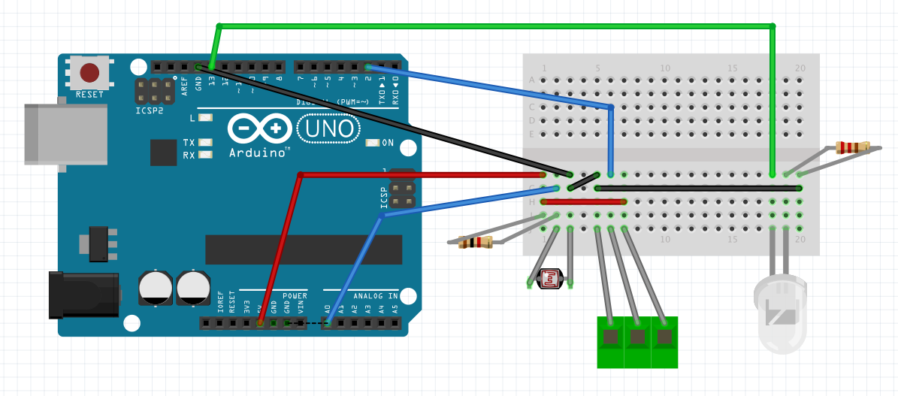

# Trigger tool from obstacle detection

This folder contains a simple arduino tool (currently tested on Arduno UNO)
that detects a physical obstacle using a photoresistor or a laser sensor and
can trigger a camera using infrared or sending a command to a serial port
that can be read by an external device (i.e. a computer with the Camera's
API to send an extended command as such a continous burst).

## Electronic layout



## Developers notes

This project has been derived from the IRremote library example on receiving
signals.

Sample generic code to debug inputs from pins:

```
void
printValuesDebug(boolean trigger, int value) {
    char number[10];
    sprintf(number, "%04d", valuealue);
    Serial.print("[");
    Serial.print(number);
    Serial.print("]");
    tokenCount++;

    if ( tokenCount == 9 ) {
        Serial.print(" - ");
    }

    if ( tokenCount >= 20 ) {
        tokenCount = 0;
        Serial.println("");
    }
}
```
